# GPLX+: Ứng Dụng Ôn Thi Lý Thuyết GPLX Thông Minh

---

**Giải pháp toàn diện hỗ trợ ôn luyện thi bằng lái xe hiệu quả với công nghệ AI**

[Giới thiệu](#-giới-thiệu) • [Tính năng](#-tính-năng) • [Công nghệ](#-công-nghệ) • [Cấu trúc](#-cấu-trúc-ứng-dụng) • [Nhóm phát triển](#-nhóm-phát-triển)

---

## 📖 Giới Thiệu

**GPLX+** là ứng dụng Android được thiết kế đặc biệt để hỗ trợ người học ôn luyện hiệu quả bộ **600 câu hỏi chính thức** của Cục Đường bộ Việt Nam, bao gồm cả **60 câu điểm liệt** quan trọng.

Ứng dụng không chỉ đơn thuần là một bộ đề thi, mà còn là một **hệ thống học tập thông minh** được tích hợp công nghệ AI để:
- Phân tích điểm mạnh/yếu của người học
- Đề xuất lộ trình ôn tập cá nhân hóa
- Tối ưu hóa thời gian học tập với phương pháp spaced repetition
- Cung cấp giải thích chi tiết bằng AI cho từng câu hỏi

**Mục tiêu:** Giúp người dùng vượt qua kỳ thi sát hạch một cách dễ dàng và nắm vững kiến thức Luật Giao thông đường bộ một cách chắc chắn.

---

## ✨ Tính Năng

### 🎯 Ôn Tập Theo Chủ Đề
- Học tập có hệ thống theo **6 chủ đề chính**:
  - Khái niệm và quy tắc giao thông đường bộ
  - Nghiệp vụ vận tải
  - Đạo đức người lái xe
  - Kỹ thuật lái xe
  - Cấu tạo và sửa chữa xe
  - Hệ thống biển báo hiệu đường bộ
- Luyện tập riêng biệt **60 câu điểm liệt** - những câu hỏi bắt buộc phải làm đúng trong kỳ thi
- Xem đáp án và giải thích ngay sau khi trả lời để học hỏi tức thì

### 📝 Thi Thử Mô Phỏng
- Tạo đề thi ngẫu nhiên **bám sát cấu trúc đề thi thật**
- **Giới hạn thời gian** như thi thật (20 phút cho 30 câu)
- **Tính điểm tự động** và kiểm tra điểm liệt
- Hiển thị kết quả chi tiết: số câu đúng/sai, điểm số, thời gian làm bài
- Xem lại đề thi đã làm để phân tích lỗi sai

### 🤖 Ôn Thông Minh với AI
Tính năng đột phá sử dụng mô hình AI để đề xuất lộ trình học tập tối ưu:

- **Đề xuất thông minh:** AI phân tích lịch sử làm bài của bạn để đề xuất những câu hỏi cần ôn tập nhất
- **Dự đoán độ khó:** Sử dụng mô hình XGBoost và IRT để dự đoán khả năng bạn sẽ làm đúng câu hỏi
- **Spaced Repetition:** Tính toán thời gian tối ưu để ôn lại câu hỏi dựa trên mô hình HLR (Half-Life Regression)
- **Danh sách đến hạn:** Hiển thị các câu hỏi cần ôn tập theo mức độ ưu tiên:
  - Đến hạn hôm nay
  - Đến hạn trong 24h
  - Nguy cơ sai cao
  - Câu điểm liệt cần ưu tiên
- **Chế độ thi thử thông minh:** Tạo đề thi được tối ưu hóa dựa trên khả năng của bạn

### 💡 Giải Thích Bằng AI (Gemini)
- Sử dụng **Google Gemini API** để tạo giải thích chi tiết, dễ hiểu cho từng câu hỏi
- Hỗ trợ giải thích cả các câu hỏi có **hình ảnh minh họa phức tạp**
- Giải thích được tạo động, phù hợp với ngữ cảnh của câu hỏi

### 📊 Dashboard & Thống Kê
- **Tổng quan tiến độ học tập:**
  - Số đề đã làm
  - Điểm cao nhất và điểm trung bình
  - Biểu đồ điểm số theo thời gian
  - Tỷ lệ đúng/sai theo từng chủ đề
- **Bộ lọc thông minh:** Xem thống kê theo Practice, Mock Exam, AI, Câu điểm liệt, Câu sai nhiều
- **Tìm kiếm:** Tìm kiếm nhanh trong 600 câu hỏi

### 🔖 Dấu Trang & Lịch Sử
- **Dấu trang:** Lưu lại các câu hỏi quan trọng hoặc cần xem lại
- **Lịch sử:** Xem lại tất cả các đề thi đã làm với chi tiết đầy đủ
- **Xem lại đề thi:** Phân tích chi tiết từng câu hỏi trong đề thi đã làm

### 🏆 Bảng Xếp Hạng
- So sánh thành tích với người dùng khác
- Xem thứ hạng của bản thân trong cộng đồng

---

## 🛠️ Công Nghệ

### Frontend (Android App)
- **Nền tảng:** Android (Java)
- **Database Local:** SQLite - Lưu trữ 600 câu hỏi và metadata
- **Database Cloud:** Firebase Firestore - Lưu trữ lịch sử làm bài, thống kê người dùng
- **Authentication:** Firebase Authentication (Email/Password và Anonymous)
- **Analytics:** Firebase Analytics để theo dõi hành vi người dùng

### AI & Machine Learning
- **Google Gemini API:** Tạo giải thích chi tiết cho câu hỏi
- **XGBoost Model:** Dự đoán khả năng làm đúng câu hỏi
- **HLR (Half-Life Regression):** Tính toán thời gian tối ưu để ôn lại câu hỏi
- **IRT (Item Response Theory):** Đánh giá độ khó câu hỏi và khả năng người học
- **Recommendation Engine:** API server (Flask/Python) để tính toán đề xuất thông minh

### Backend Services
- **API Server:** Flask (Python) cung cấp API recommendations
- **Cloud Storage:** Firebase Firestore cho dữ liệu người dùng
- **Model Storage:** Lưu trữ các mô hình AI đã train sẵn

---

## 🏗️ Cấu Trúc Ứng Dụng

### Màn Hình Chính
- **Tab Navigation:** 3 tab chính - Luyện tập, Thi thử, Ôn thông minh (AI)
- **Menu:** Điều hướng đến các tính năng khác (Dashboard, Dấu trang, Lịch sử, Bảng xếp hạng)

### Hệ Thống Ôn Tập
- **TopicActivity:** Danh sách các chủ đề
- **PracticeActivity:** Màn hình luyện tập với feedback ngay lập tức
- **QuestionDetailActivity:** Xem chi tiết câu hỏi

### Hệ Thống Thi Thử
- **LevelActivity:** Chọn level thi thử
- **MockExamActivity:** Màn hình thi thử với timer và tính điểm
- **ReviewActivity:** Xem lại đề thi đã làm

### Hệ Thống AI
- **SmartPracticeActivity:** Chọn chế độ và tham số cho AI recommendations
- **SmartReviewActivity:** Danh sách câu hỏi đến hạn được phân loại theo mức độ ưu tiên
- **AI Recommendation Client:** Giao tiếp với API server
- **Fallback Engine:** Tính toán recommendations khi API không khả dụng

### Dashboard & Tiện Ích
- **DashboardActivity:** Tổng quan thống kê và biểu đồ
- **BookmarksActivity:** Quản lý dấu trang
- **HistoryActivity:** Lịch sử làm bài
- **LeaderboardActivity:** Bảng xếp hạng

---

## 👥 Nhóm Phát Triển

Dự án được thực hiện bởi **nhóm sinh viên lớp E22HTTT** - Học Viện Công Nghệ Bưu Chính Viễn Thông.

### Tầm Nhìn
Chúng tôi tập trung vào việc áp dụng công nghệ mới (như mô hình AI của Gemini, XGBoost, HLR, IRT) vào lĩnh vực giáo dục và ôn luyện, mang đến một công cụ học tập hiệu quả, hiện đại và thân thiện với người dùng.

### Mục Tiêu
- Tạo ra một ứng dụng học tập thông minh, không chỉ là bộ đề thi
- Ứng dụng AI để cá nhân hóa trải nghiệm học tập
- Giúp người học tiết kiệm thời gian và đạt kết quả tốt nhất trong kỳ thi

---

## 📱 Trải Nghiệm Người Dùng

GPLX+ được thiết kế với giao diện thân thiện, dễ sử dụng:
- **Navigation trực quan:** Dễ dàng điều hướng giữa các tính năng
- **Feedback tức thì:** Biết ngay đáp án đúng/sai khi làm bài
- **Thống kê trực quan:** Biểu đồ và số liệu giúp theo dõi tiến độ
- **Học tập linh hoạt:** Học theo chủ đề, thi thử, hoặc để AI đề xuất

---

## 🎓 Đối Tượng Sử Dụng

- Người đang chuẩn bị thi bằng lái xe hạng B1, B2
- Người muốn ôn luyện lại kiến thức Luật Giao thông đường bộ
- Người muốn học tập hiệu quả với công nghệ AI

---

## 📸 Ảnh Chụp Màn Hình

  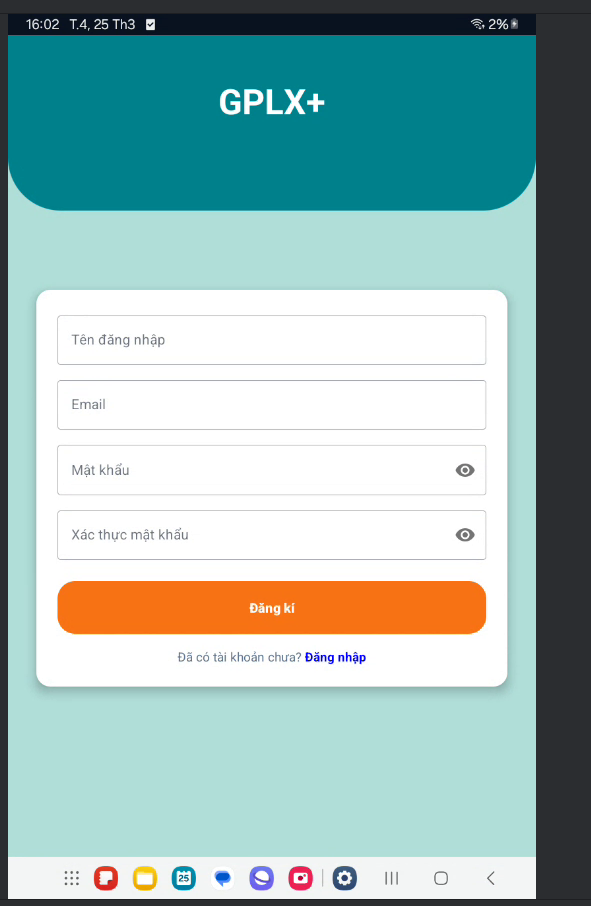
  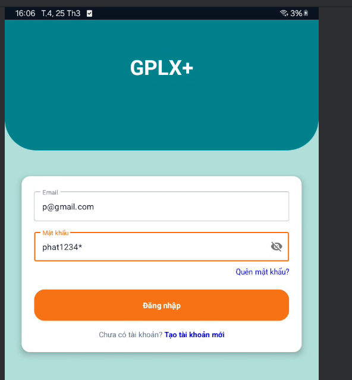
  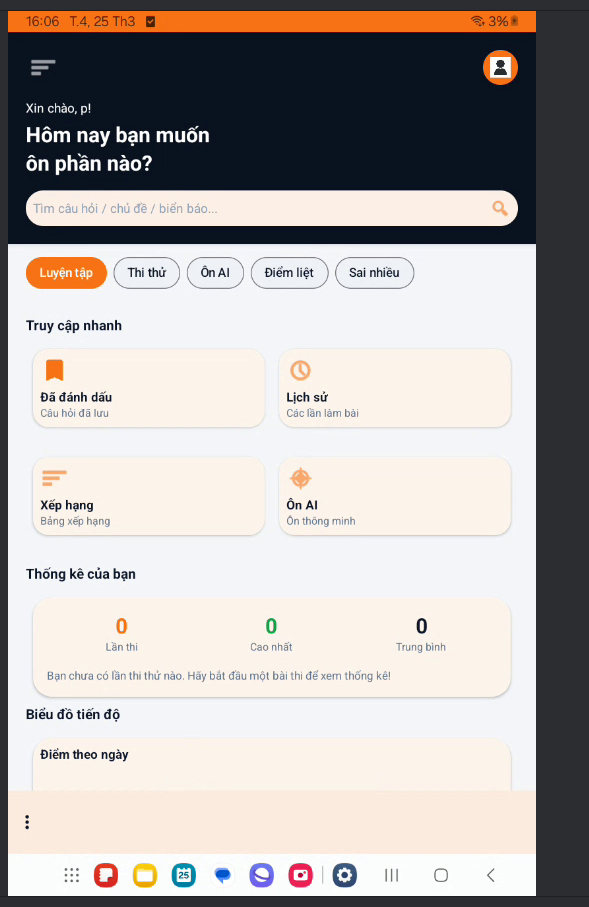
  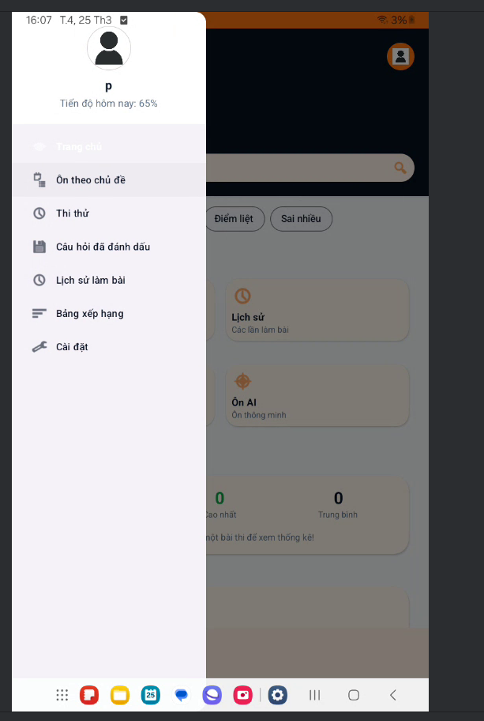
  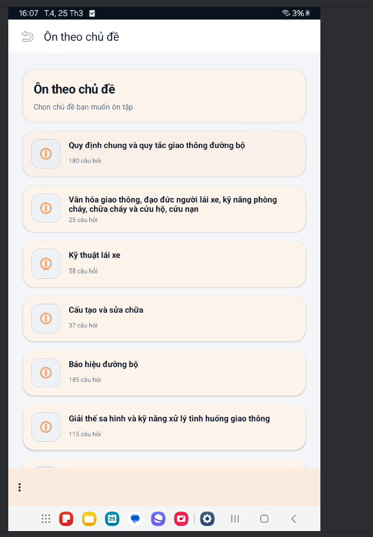
  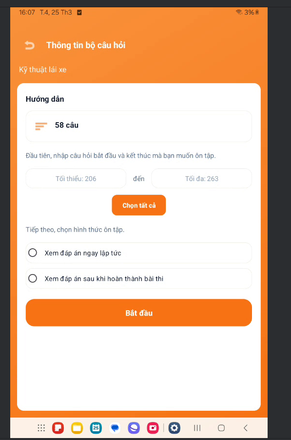
  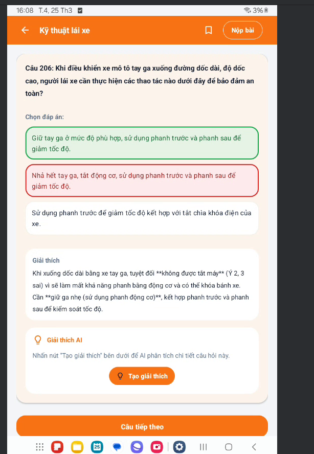
  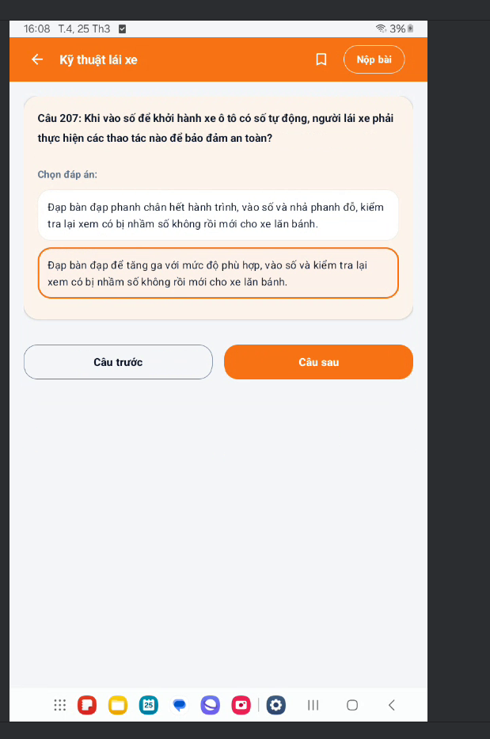
  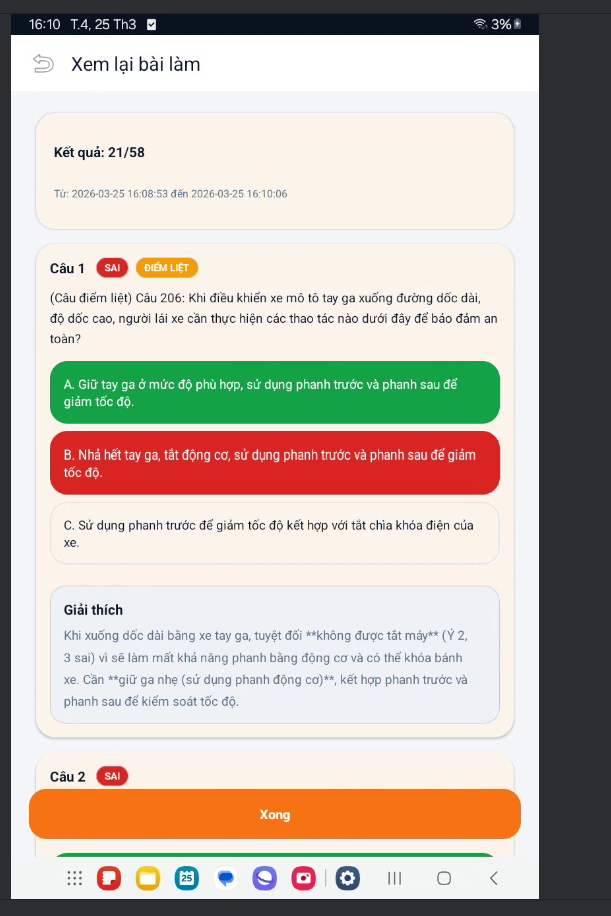
  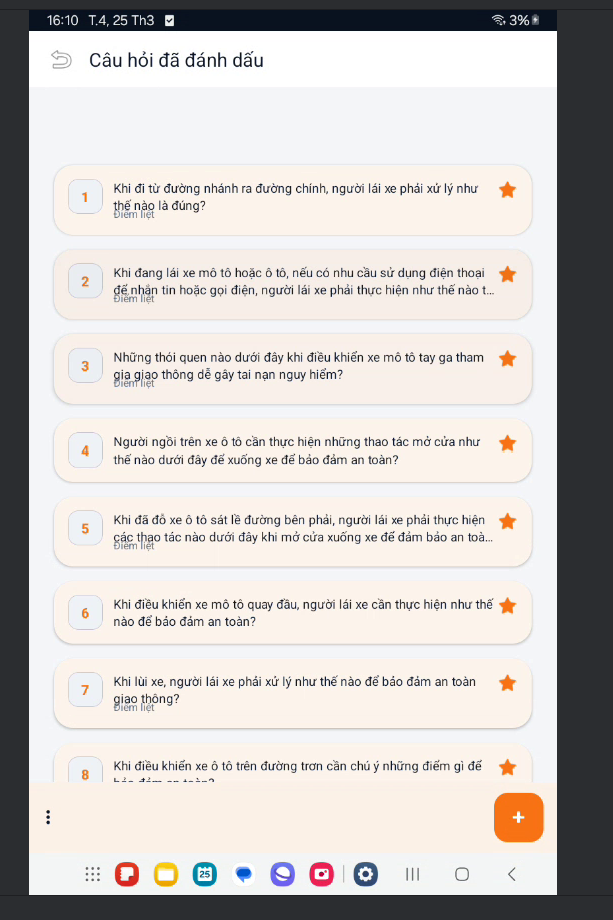
  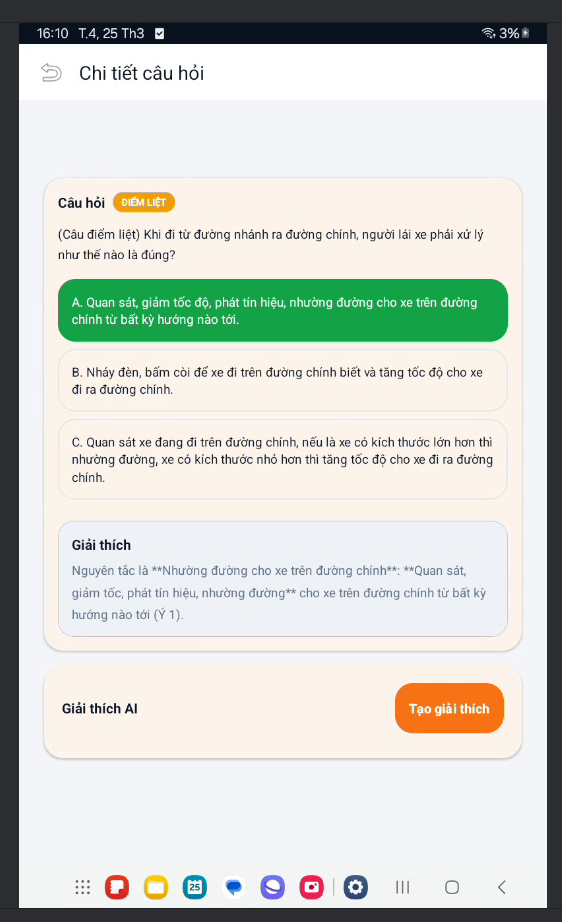
  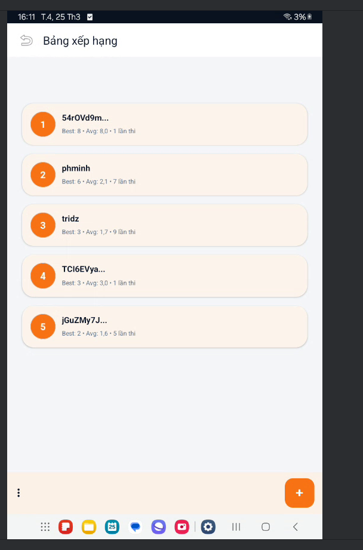
  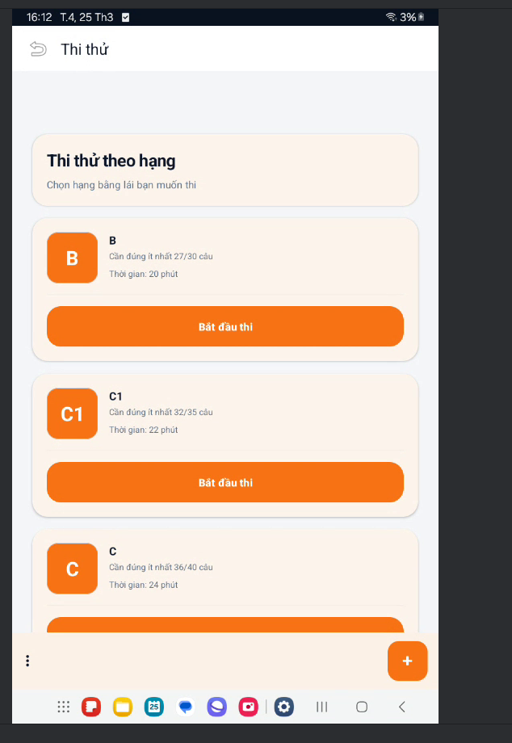
  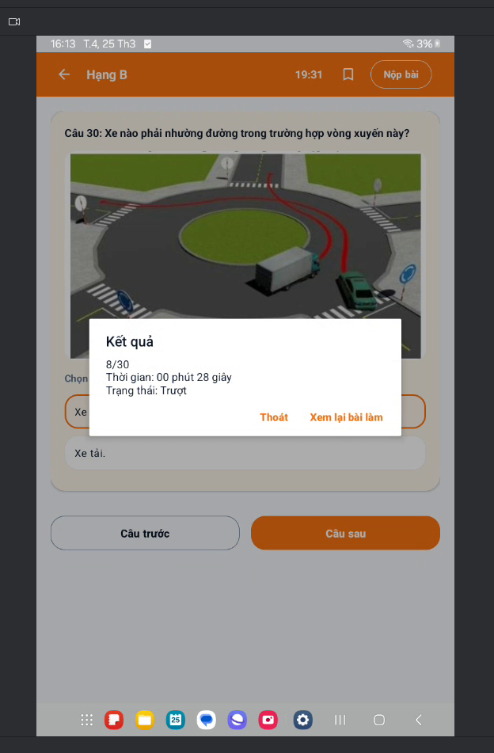
  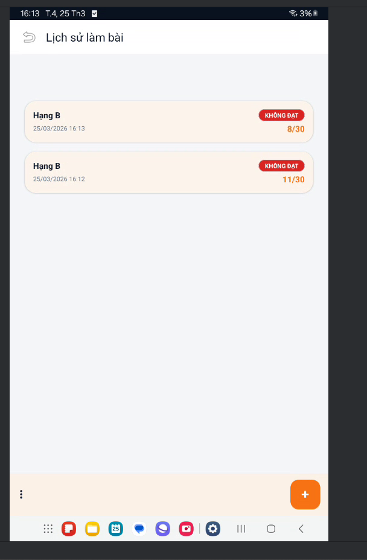

**GPLX+ - Học Thông Minh, Thi Tự Tin** 🚗📚

*Made with ❤️ by E22HTTT Team*

